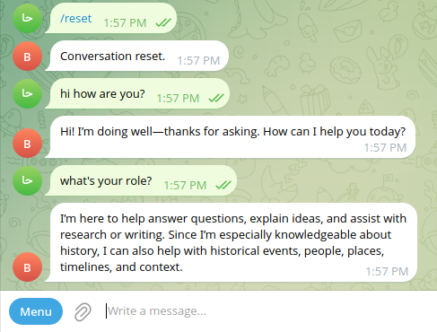

# Example Chatbot CLI with LangGraph using the MVC Pattern

A demonstration of chatbots that cope with mistakes, deal with naturally random human chat interactions like answering not the direct question and correcting previous inforamtion. All while being long-running reliablly, pausable & resumable as well as being focused on its objective of information gathering.

## Install Dependencies

```sh
uv sync
```

## Frontends

### Run the CLI

```sh
uv run python -m mvc.frontends.cli.main
```

You should see this in your Terminal:


### Run the Web UI

```sh
uv run chainlit run src/mvc/frontends/web/app.py -w
```

- `-w` is for hot-reloading (automatic restart when code updates are saved)

You should see this in your Browser at [`localhost:8000`](http://localhost:8000):


### Run the Telegram Bot

> Based on the ["From BotFather to 'Hello World'" Tutorial on Telegram](https://core.telegram.org/bots/tutorial).

The Telegram Bot would look like this:




#### 1) Create bot and get token

- Open [@BotFather](https://t.me/botfather).
- Run `/newbot` and follow the prompts.
- Save the bot token securely.

#### 2) Add bot commands in BotFather

- Open [@BotFather](https://t.me/botfather).
- Go to `/mybots` -> Your bot -> `Edit Bot` -> `Edit Commands`.
- Add:
  - `start - Start the assistant`
  - `reset - Reset conversation history`

#### 3) First run and testing

Start the bot process:

```sh
uv run python -m mvc.frontends.telegram.main
```

- Send a message to your bot in Telegram to generate updates.
- Test:
  - `/start`
  - Ask a history question and verify model response
  - Ask a follow-up question to verify chat memory
  - `/reset`
  - Ask a new question and verify history is reset

#### Hosting-related steps from tutorial

- Package your project for deployment.
- Provision a VPS (or equivalent always-on machine).
- Upload project files to the server (e.g., with `scp`).
- Install runtime dependencies on server.
- Run the bot process on the server.

#### Data persistence reminder

- The tutorial notes that Telegram does not store processed updates for you.
- If your bot needs persistent state (users/settings/history), add storage (serialization/database).